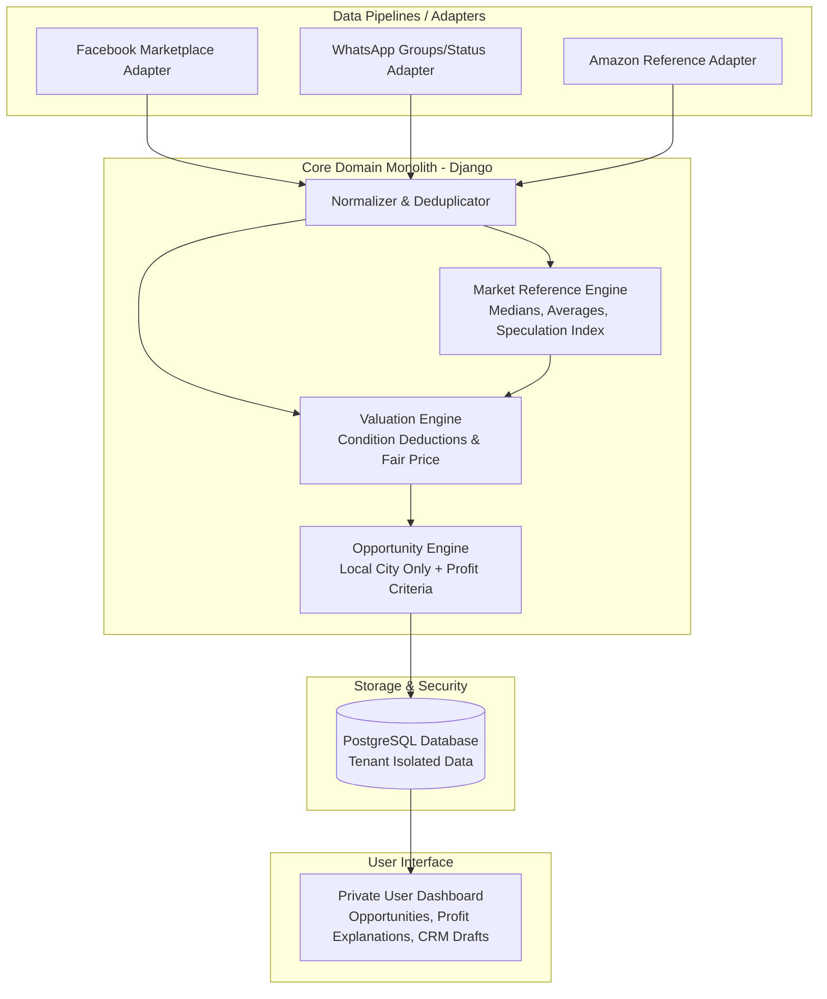

# iPhone Deal Finder — Master Project & Agent Guidelines (AGENTS.md)

## 1. Executive Summary & Business Vision
iPhone Deal Finder is a multi-tenant SaaS platform that helps local electronics buyers and deal-hunters identify, evaluate, and capitalize on profitable used iPhone listings in their operational market.

### Core Business Unit Economics & Criteria
- **Target Purchase Range:** $100 – $250 per device.
- **Target Resale Timeframe:** Fast turnover (1 to 2 weeks).
- **Target Minimum Profit:** $30 minimum profit margin per device (Ideal target: $40 – $50+).
- **Usability Priorities:**
  1. **Functional:** Real-time accuracy in market reference data and valuation formulas.
  2. **Practical:** Faster and easier to use than manual spreadsheet/browsing analysis.
  3. **UI/UX Friendly:** Clean dashboard with actionable opportunity alerts, profit calculations, and clear explanation codes.

---

## 2. Core Business Logic & Domain Rules

### Operational Market vs. Reference Market (CRITICAL SEPARATION)
- **Operational Market:** The specific city/market where the user actually buys and flips devices (e.g., Maturín, Monagas).
  - Listings from the operational market are candidates to become **Operational Opportunities**.
- **Reference Market:** Price observations from other cities (e.g., Caracas, Valencia) or external platforms (e.g., Amazon Used/Refurbished).
  - Used *exclusively* for computing market statistics (averages, medians, P25, P75) and measuring local market speculation.
  - **CRITICAL RULE:** Never classify a listing from a non-operational city as an operational buying opportunity, regardless of how attractive the price appears.

### Product Identity & Attribute Granularity
Market statistics, reference benchmarks, and resale valuations MUST be segmented strictly by:
1. **Exact Model:** (e.g., iPhone 11, iPhone 12 Pro)
2. **Storage Capacity:** (e.g., 64GB, 128GB, 256GB, 512GB). *Do not mix storage capacities into the same market statistic.*
3. **Color Tier:** (e.g., Silver/White [high demand/premium], Black [common], Product Red/Others).
4. **Condition & Defect Adjustments:**
   - **Battery Health %:** (e.g., <80% requires battery replacement cost deduction).
   - **Screen Condition:** Intact vs. scratches vs. cracked screen.
   - **Body / Cosmetic Scratches.**
   - **Hardware Defects:** Face ID working/broken, Main/Front Camera issues.
   - *Condition adjustments must be configurable and evidence-based (no hardcoded arbitrary guesses).*

---

## 3. Data Pipelines & Multi-Source Architecture

The platform uses a modular adapter pattern:
`Source Adapter -> Raw Listing -> Normalized Domain -> Valuation Engine`

1. **Facebook Marketplace Adapter:** Primary local operational & regional reference source.
2. **WhatsApp Pipeline Adapter (Future Expansion):** Ingestion of local WhatsApp groups and status updates tagged for the user's city (e.g., local Maturín resale groups).
3. **Amazon Reference Adapter:** Ingests refurbished/used iPhone benchmark prices from Amazon to gauge local market speculation vs global market value.

---

## 4. Platform Delivery Options & Recommended Architecture

### Architecture Proposal: Hybrid Web Monolith + Browser-Assisted Capture
- **Backend Framework:** Django (Python 3.12+) — Clean, robust monolithic architecture.
- **Database:** PostgreSQL (Multi-tenant ready schema: Shared schema with `tenant_id` user isolation).
- **Frontend MVP:** Django Templates + Alpine.js / HTMX + Bootstrap 5 (Responsive, fast, interactive).
- **Data Capture Helper:** Lightweight Browser Extension or user-assisted bookmarklet for local Marketplace/WhatsApp capture.

### Architectural Data Flow Diagram

---

## 5. Multi-Tenant SaaS Requirements

- **User Data Isolation:** Each user owns their account, operational market settings, budget limits, target profit margins, saved listings, and negotiation notes.
- **Configurable User Profile & Financial Parameters:**
  1. **Configurable Capital/Budget Range (`min_budget`, `max_budget`):** Default $100–$250, but fully modifiable by each user according to their available working capital.
  2. **Configurable Target Profit Margin (`min_profit`):** Default $30 (or $40–$50+), but fully modifiable per user.
  3. **Configurable Operational Market (`operational_city`):** City where buying opportunities are filtered.
- **Shared Reference Catalog:** Standardized iPhone catalog, model/storage definitions, and aggregated reference market prices are shared across tenants to prevent data duplication.
- **Authentication & Settings:** Built-in Django authentication with user setting controls.

---

## 6. CRITICAL: Compliance & Data Collection Feasibility Gate

Meta/Facebook actively detects and enforces policies against unauthorized automated scraping.

### Mandatory Rules for Data Collection
- **NO Anti-Bot Evasion:** Do NOT implement CAPTCHA bypass, stealth browser fingerprinting, proxy rotation to dodge bans, credential theft, or unauthorized API scraping.
- **Browser-Assisted Workflow:** Capture data through the user's normal, authenticated browser session or user-provided URLs/assisted imports.
- **Feasibility Gate (Phase 1):** Validate visible field extraction (Title, Price, Location, URL, Model/Storage/Condition text) using a local prototype before building full ingestion pipelines.

---

## 7. Development Roadmap

- **Phase 0:** Master Specification & Git Setup (Completed).
- **Phase 1:** Facebook Marketplace & Data Feasibility Prototype.
- **Phase 2:** Development Environment (Docker + PostgreSQL + Django).
- **Phase 3:** SaaS Foundations (User Auth, Settings, Operational Market Isolation).
- **Phase 4:** Product Catalog Domain (iPhone Models, Storage, Color Tiers).
- **Phase 5:** Listing & Condition Engine (Defect deductions, Battery health).
- **Phase 6:** Market Reference & Speculation Engine (Amazon & Regional Statistics).
- **Phase 7:** Valuation & Opportunity Engine (Profit = Estimated Resale - Purchase Price - Repairs).
- **Phase 8:** User Dashboard & Opportunity Alerts.
- **Phase 9:** WhatsApp & Multi-Source Adapter Expansion.
- **Phase 10:** CRM & Seller Negotiation Helper (Manual deal tracking).
- **Phase 11:** Production Cloud Deployment & SaaS Subscription Billing.

---

## 8. Development & Agent Rules
- Work incrementally and run verification checks (`git status`, tests) after every change.
- Never commit secrets or expose user data.
- Keep core business logic decoupled from scraping DOM structure.
